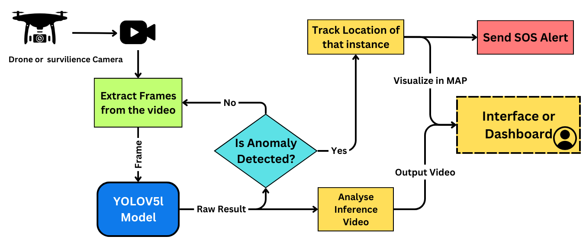
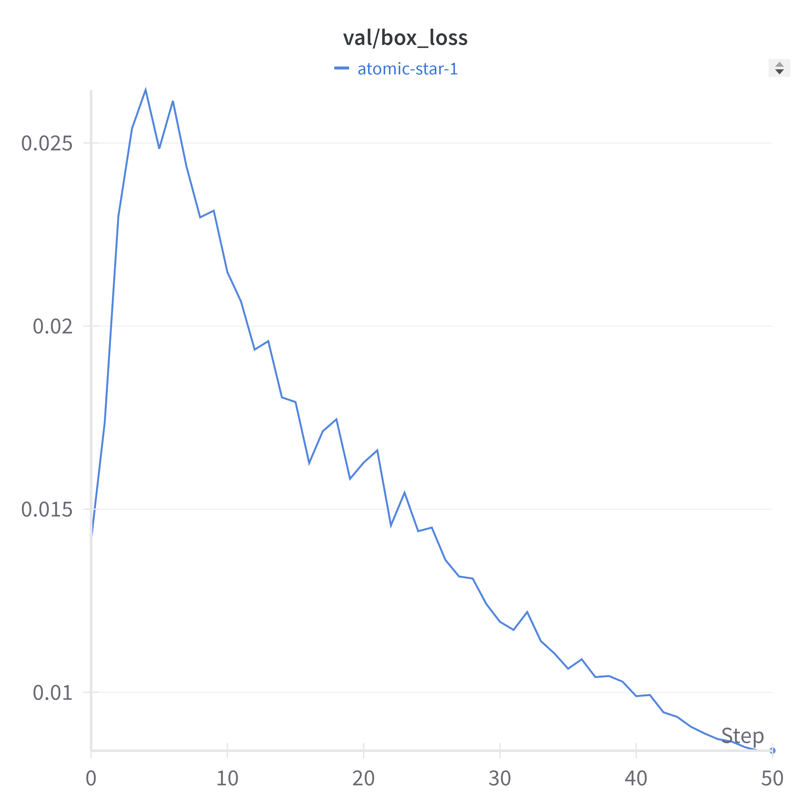
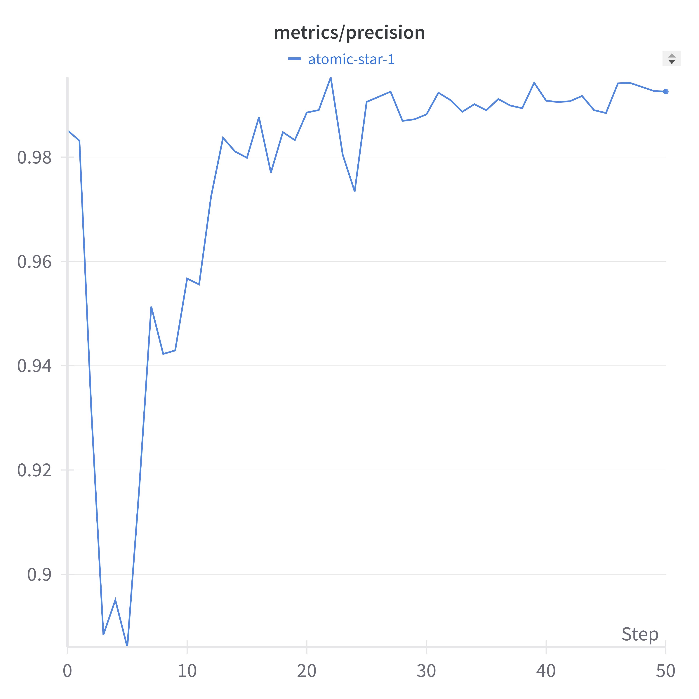
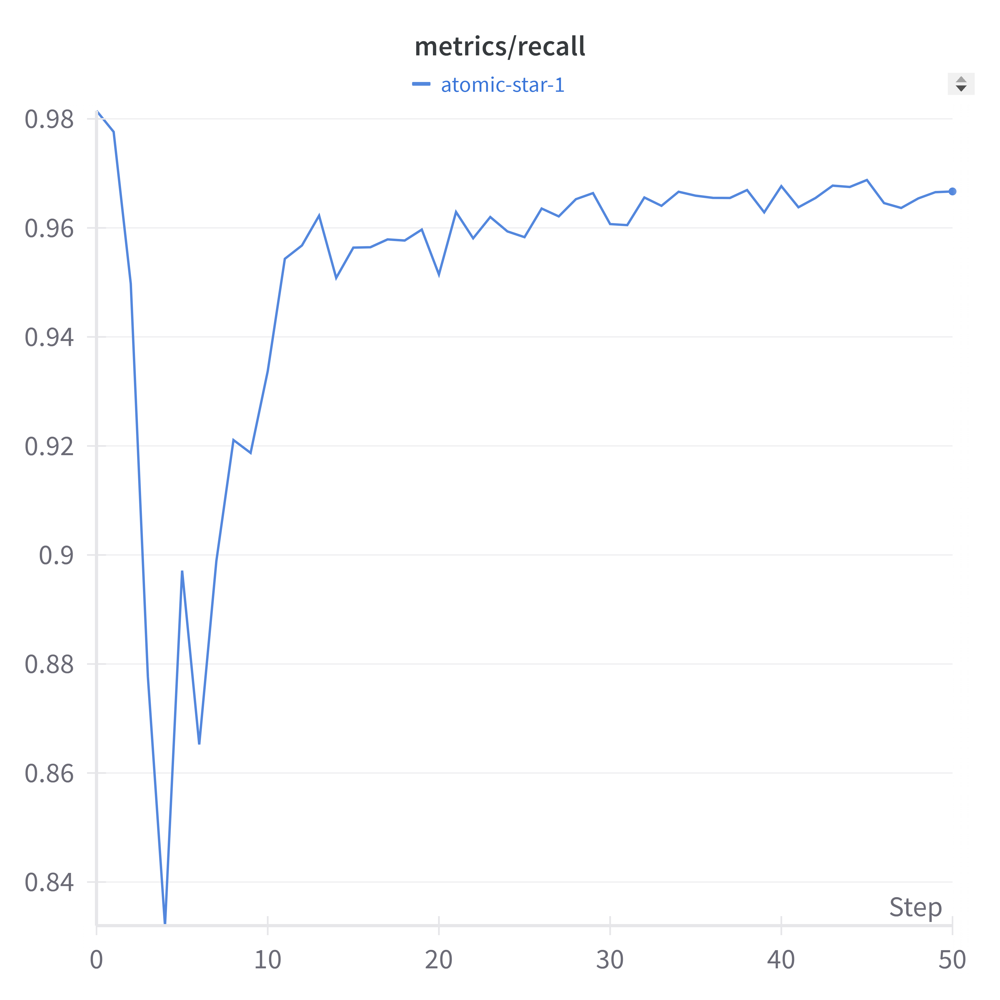
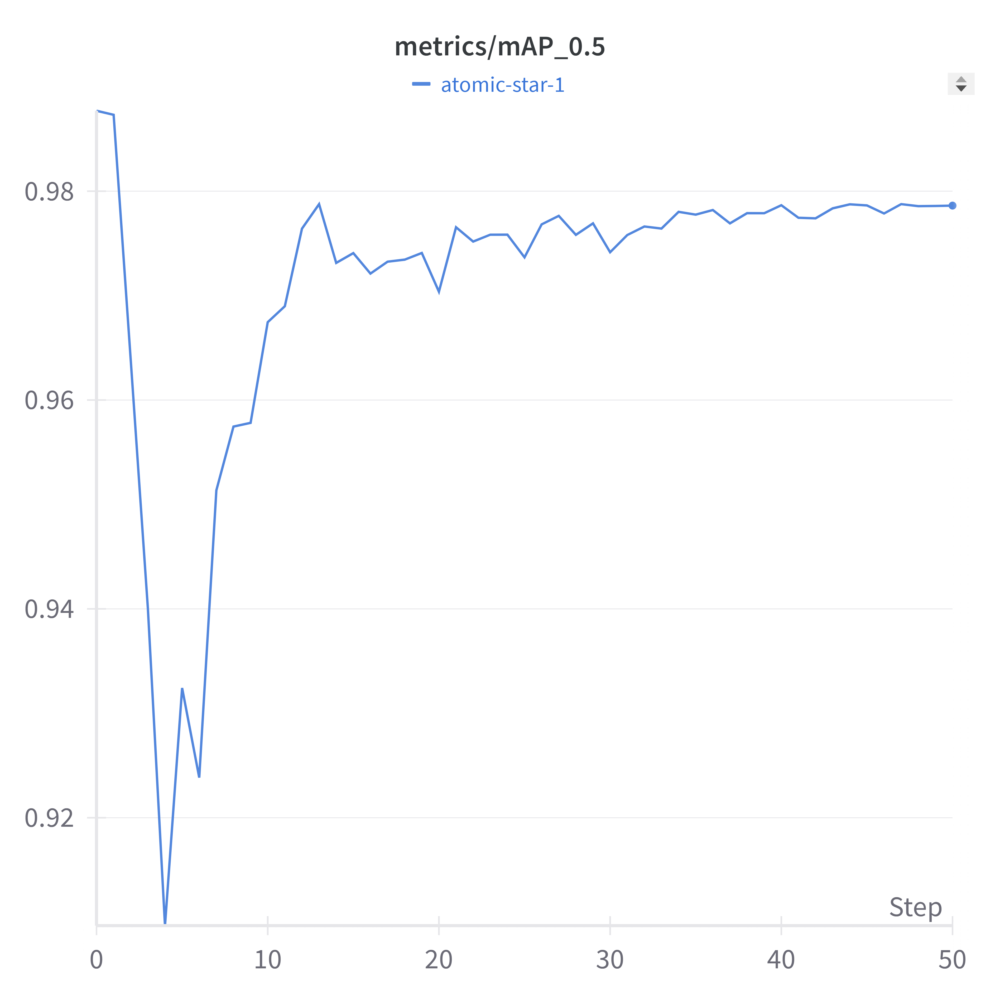
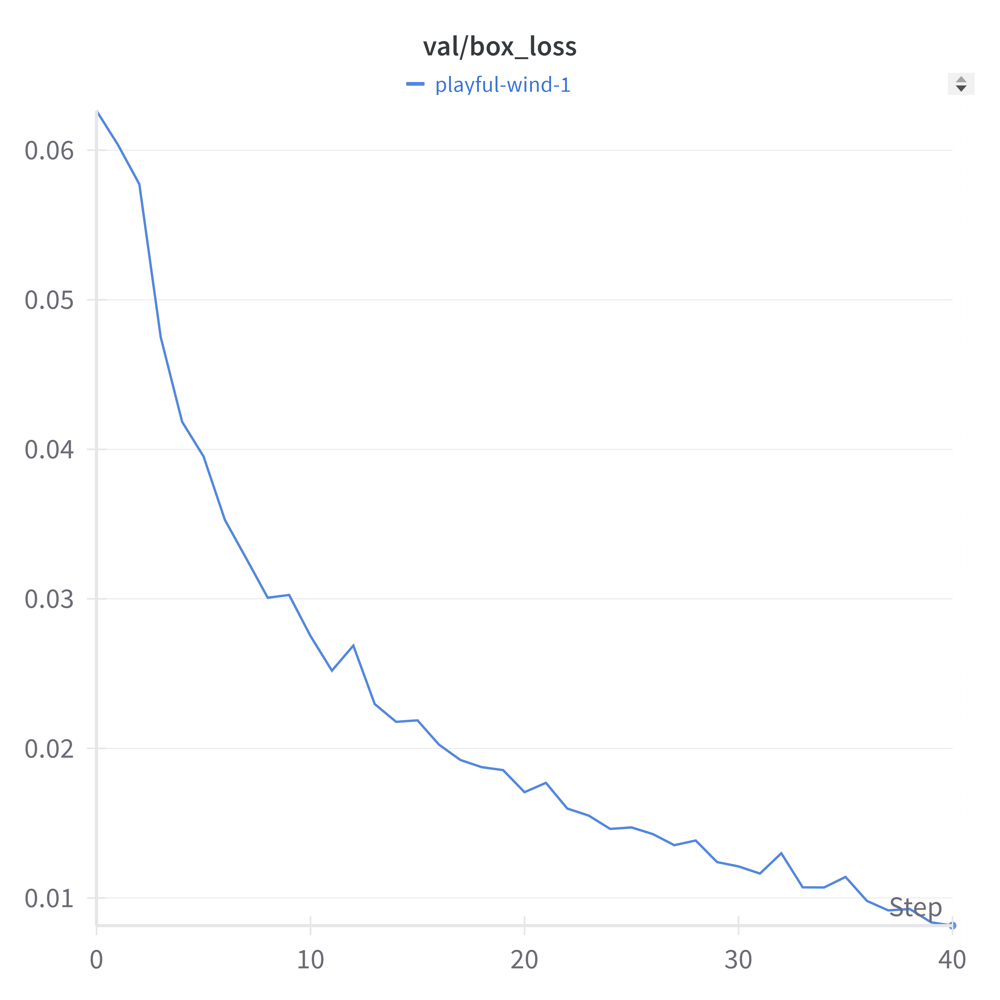
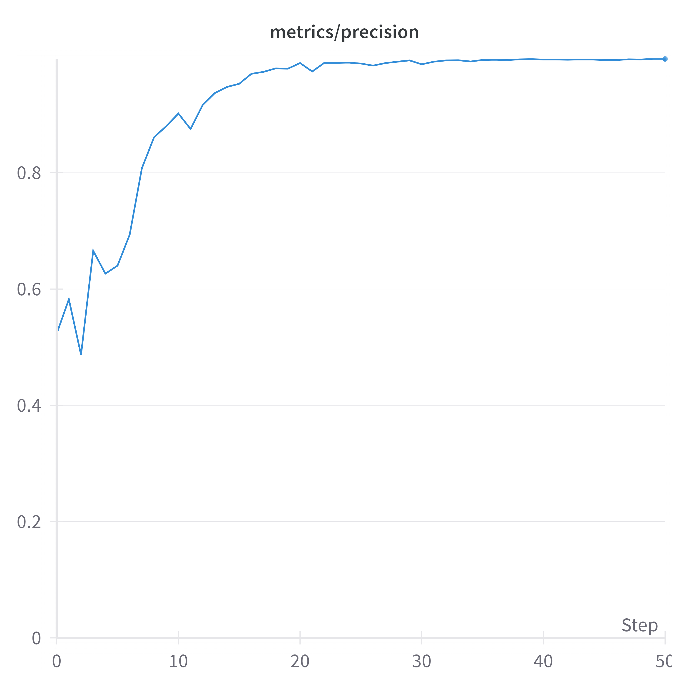
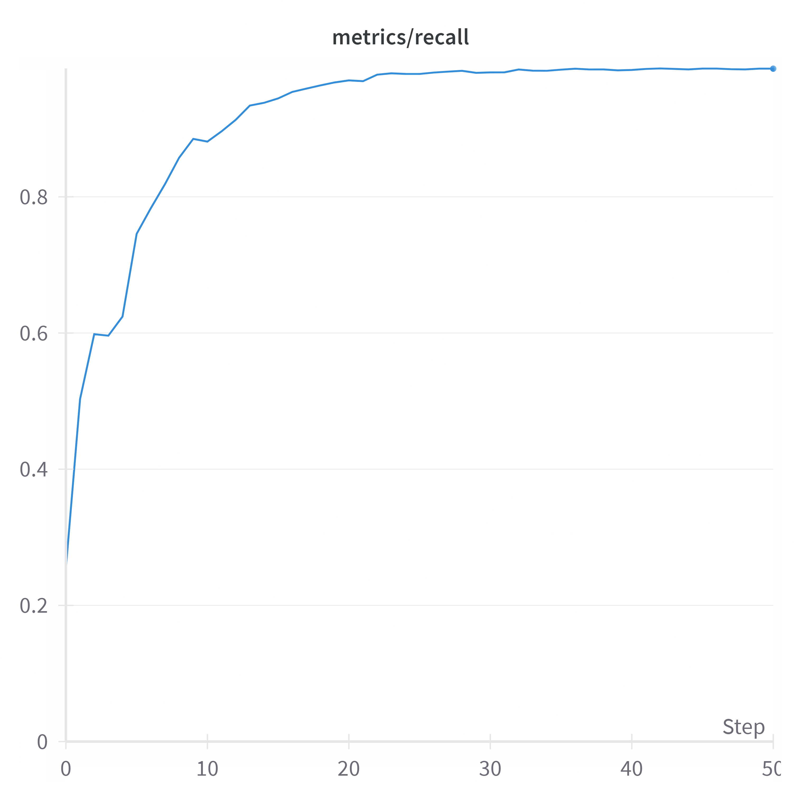
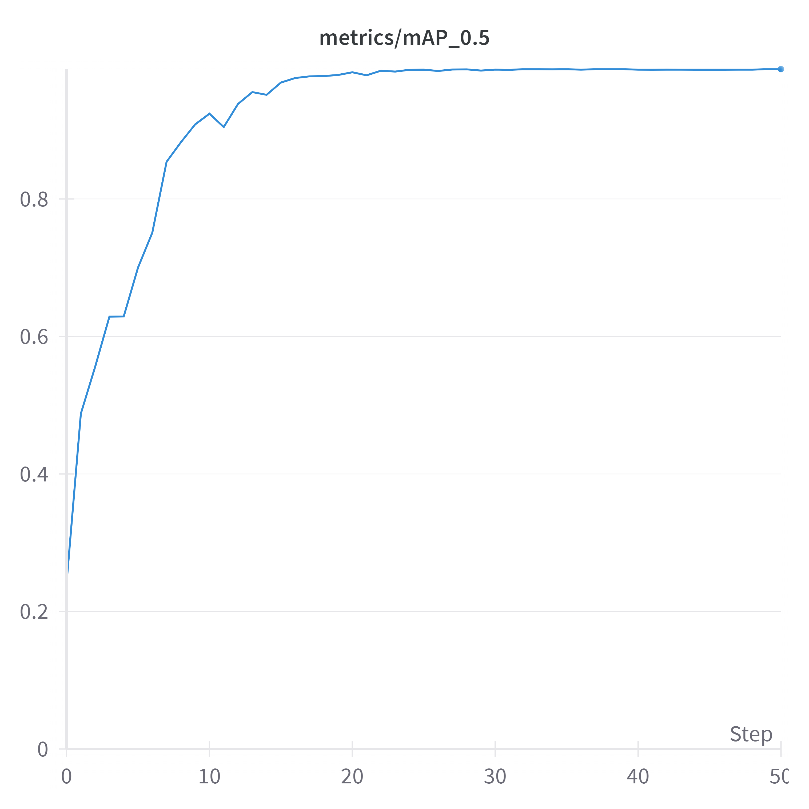

# Wildlife Monitoring and Anomaly Detection System

Welcome to our Wildlife Monitoring and Anomaly Detection System! This project leverages state-of-the-art deep learning technology to enhance wildlife conservation through real-time monitoring and emergency alert mechanisms.

## Table of Contents

1. [Introduction](#introduction)
2. [System Architecture](#system-architecture)
3. [Results](#results)
4. [Dataset](#dataset)
5. [Usage](#usage)
6. [Conclusion](#conclusion)

---

## Introduction

Wildlife poaching, habitat destruction, and unauthorized human activities in protected areas are escalating threats to biodiversity. Our system offers a cost-effective, real-time solution using YOLOv5 to detect various anomalies, including poaching, unauthorized vehicles, wild animals, and forest fires. By addressing these issues with high precision and recall, our project plays a critical role in conservation efforts.

### Sample Video
https://github.com/user-attachments/assets/eb8b9431-d138-4b47-8f4d-b65f54668ba1


---

## System Architecture

Our system processes input frames from live video feeds, using drones, UAVs, or surveillance cameras. It utilizes YOLOv5 for anomaly detection and generates emergency alerts. Below are our architecture and workflow diagrams:

### Workflow Diagram
  

1. **Input**: Captured by UAVs or stationary cameras.
2. **Frame Extraction**: The video is broken into frames.
3. **Detection**: YOLOv5 identifies anomalies.
4. **Alert System**: Notifies relevant authorities via API.
5. **Visualization**: Displays detected events on an interactive map.

### Architecture Overview
  

- **Backbone**: CSP-Darknet53, optimized for efficient feature extraction.
- **Neck**: Uses advanced blocks and SPPF for feature pyramid representation.
- **Head**: Responsible for final object detection outputs.

---

## Results

Our experiments yielded outstanding results, demonstrating high precision and recall for multiple anomaly detection tasks:

### Training Curves

Our model was trained and evaluated under different lighting conditions (day and night), with the following performance curves:

### Day Training Curves
| Loss Curve (Day) | Precision Curve (Day) | Recall Curve (Day) | mAP Curve (Day) |
|:----------------:|:---------------------:|:------------------:|:---------------:|
|  |  |  |  |

### Night Training Curves
| Loss Curve (Night) | Precision Curve (Night) | Recall Curve (Night) | mAP Curve (Night) |
|:------------------:|:-----------------------:|:--------------------:|:-----------------:|
|  |  |  |  |


### Task-Specific Performance
| Task                     | Class         | Precision | Recall | mAP@0.5 | mAP@0.5:0.9 |
|-------------------------- |-------------- |-----------|--------|---------|-------------|
| Wild Animal Surveillance  | Elephant      | 0.976     | 0.827  | 0.911   | 0.839       |
| Wildfire Detection        | Fire/Smoke    | 1.000     | 0.915  | 0.957   | 0.935       |
| Vehicle Detection         | Vehicle       | 0.996     | 0.885  | 0.940   | 0.858       |
| Poacher Detection         | Human/Poacher | 1.000     | 0.987  | 0.993   | 0.965       |

---

## Dataset

Our dataset is carefully constructed to ensure diversity and robustness across multiple classes.

- **Training Data**: Collected from publicly available sources such as Roboflow and Kaggle, along with frames extracted from various wildlife surveillance videos. We annotated 3,193 images for training.
- **Validation and Testing**: Contains 684 and 685 images, respectively, sourced similarly to maintain consistency and diversity.
- **Classes**: Includes categories like person, elephant, zebra, giraffe, deer, bison, rhino, boar, leopard, vehicle, and fire.
- **Annotation Tools**: Labelimg, CVAT, and Make-Sense were used for manual annotation. The annotations were converted to YOLOv5 format, and cross-verification was done to ensure accuracy.

---

## Usage

*This section will be filled in manually. Provide details about setting up the environment, dependencies, and running the model.*

```bash
# Example command to run the system
python run_detection.py --config config.yaml
```

---


## Conclusion

This Wildlife Monitoring and Anomaly Detection System showcases the potential of deep learning for real-time wildlife conservation. Our YOLOv5-based model, combined with a robust alert mechanism, provides a scalable and efficient tool for conservationists and authorities. We encourage collaboration and feedback to further enhance the system's capabilities.

Feel free to contribute, raise issues, or provide suggestions in this repository. Together, we can make a significant impact on wildlife conservation!

